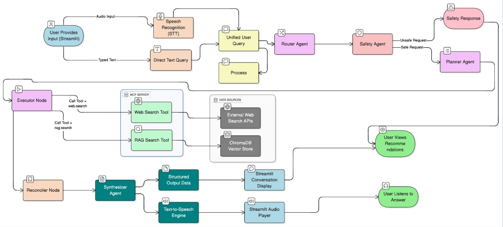
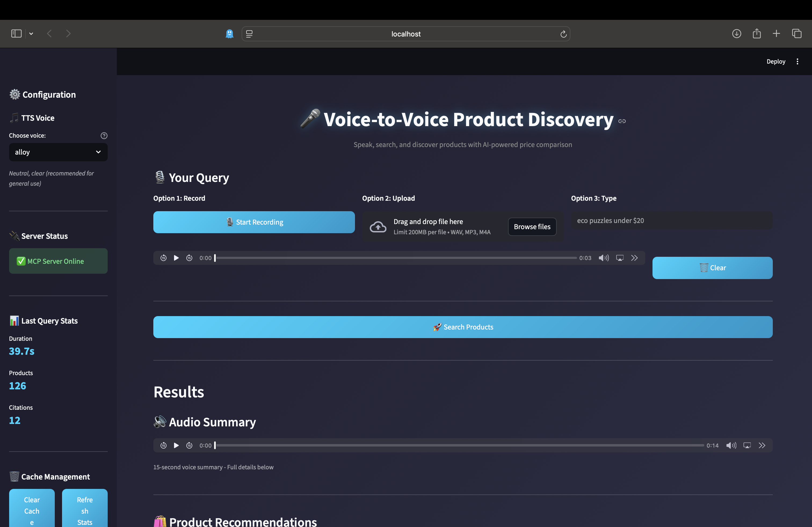
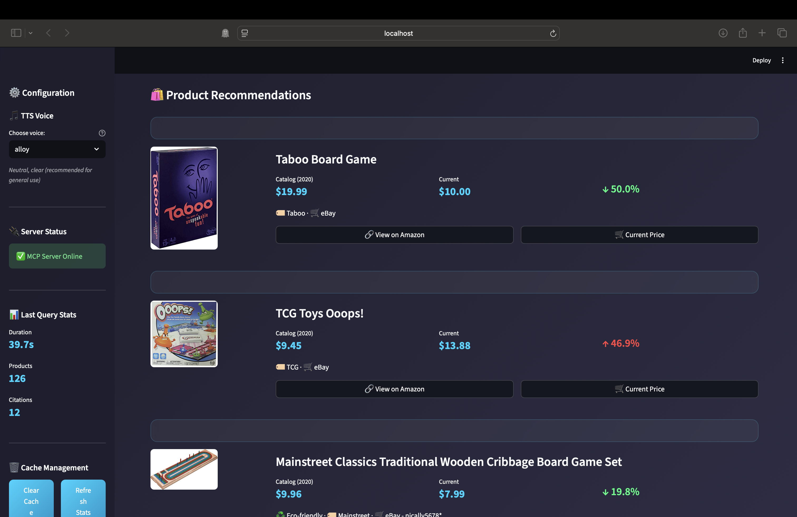

# Agentic Voice-to-Voice AI Assistant for Product Discovery

An intelligent product search assistant that combines voice interaction, semantic search, and real-time price comparison using LangGraph, OpenAI, and ChromaDB.

## Table of Contents
- [Overview](#overview)
- [Dataset & Preprocessing](#dataset--preprocessing)
- [System Architecture](#system-architecture)
- [Models & Technology Stack](#models--technology-stack)
- [Evaluation Results](#evaluation-results)
- [Installation & Setup](#installation--setup)
- [Usage](#usage)
- [Project Structure](#project-structure)
- [Contributors](#contributors)

---

## Overview

This system enables natural voice-based product discovery with historical price comparison:

**What it does:**
- Accepts voice or text queries for product searches
- Searches a 2020 Amazon product catalog using semantic search (RAG)
- Fetches current prices from the web via Google Shopping
- Compares historical vs. current prices and detects conflicts
- Generates voice responses with product recommendations
- Provides an interactive Streamlit UI with real-time updates

**Example query:**
"Find board games under $20" → System returns catalog products from 2020, fetches current prices, compares them, and generates a voice summary.

---

## Dataset & Preprocessing

### Source Data
- **Dataset:** Amazon Product Data 2020 (Hugging Face: `calmgoose/amazon-product-data-2020`)
- **Size:** 10,002 products → 8,661 products after cleaning (86.6% retention)
- **Categories:** 22 main categories dominated by Toys & Games (73%)

### Key Statistics
- **Price Range:** $0.50 - $5,332.00 (Median: $16.99, Mean: $40.31)
- **Distribution:** 69% under $25, making it ideal for budget-conscious queries
- **Text Coverage:** 98% have descriptions, 100% have images
- **Brands:** 2,406 unique brands identified

### Preprocessing Pipeline

**1. Data Cleaning**
- Removed 6 sparse columns (UPC: 99.7% missing, Dimensions: 95% missing)
- Dropped 992 products missing price, category, or all text fields
- Normalized prices and removed invalid entries

**2. Text Processing**
- Removed boilerplate phrases and special characters
- Combined title, description, specifications, and details into unified text
- Average text length: 1,304 characters per product

**3. Feature Engineering**
- Parsed category hierarchy (3 levels: main → sub → leaf)
- Extracted brands from product titles
- Detected materials and eco-friendly keywords
- Created price buckets (budget, mid, premium)
- Generated citation IDs (doc_00000 to doc_08660)

**4. Vector Database**
- Generated 1536-dimensional embeddings using OpenAI text-embedding-3-small
- Indexed 8,661 products in ChromaDB with metadata (price, category, brand, materials)
- Search performance: 10-50ms average query time
- One-time embedding cost: $0.22

---

## System Architecture



### Components

**Streamlit UI**
- Voice recording interface with live audio capture
- Product cards with images, prices, and ratings
- Real-time agent execution logs

**LangGraph Workflow (6 Nodes)**
- Orchestrates multi-step workflow with state management
- Coordinates LLM agents and processing nodes

**MCP Server (FastAPI)**
- Provides two tools: rag.search and web.search
- Handles caching and rate limiting

**Voice Module**
- ASR: OpenAI Whisper for speech-to-text
- TTS: OpenAI TTS-1 for text-to-speech

**Data Layer**
- ChromaDB: Vector database for semantic search
- SerpAPI: Real-time web search via Google Shopping

### Workflow Nodes

The system uses 6 nodes in a sequential workflow:

**1. Router (LLM Agent)**
- Extracts intent from user query using GPT-4o
- Parses product type, budget, price range, category, and filters
- Example: "board games under $20" → {product_type: "game", price_max: 20.0}

**2. Safety (LLM Agent)**
- Content moderation using GPT-4o
- Blocks queries for weapons, medications, adult content
- Returns safe/unsafe flag with reason

**3. Planner (LLM Agent)**
- Plans search strategy using GPT-4o
- Decides which tools to call (rag.search, web.search)
- Sets parameters (query terms, filters, result count)

**4. Executor (Processing Node)**
- Calls MCP tools in parallel
- Executes 5 RAG searches (catalog products)
- Executes 6 web searches (current prices for each product + alternatives)
- Implements caching for repeated queries

**5. Reconciler (Processing Node)**
- Fuzzy matching algorithm (not LLM-based)
- Matches catalog products to web results using brand (40%) and title (60%) similarity
- Detects price conflicts (>20% or >$5 difference)
- Uses ThreadPoolExecutor for parallel matching (3-5x speedup)

**6. Synthesizer (LLM Agent)**
- Generates final answer using GPT-4o
- Creates comparison table with matched products and price changes
- Produces 15-second TTS summary with top 3 products
- Includes citations from catalog (doc IDs) and web sources

**Prompt Engineering:**
All LLM prompts are centralized in `src/agents/prompts.py` for easy modification and version control.

---

## Models & Technology Stack

### Large Language Model
**GPT-4o (OpenAI)**
- Used in 4 nodes: Router, Safety, Planner, Synthesizer
- Handles intent extraction, content moderation, planning, and generation
- Cost: ~$0.015 per query (6 total calls)

### Embedding Model
**text-embedding-3-small (OpenAI)**
- 1536-dimensional vectors for semantic search
- Chosen over open-source alternatives for production-grade quality
- One-time indexing cost: $0.22 for 8,661 products

### Speech Models
**Whisper (OpenAI)** - Speech-to-text
- Supports WAV, MP3, M4A formats
- Cost: ~$0.0003 per query

**TTS-1 (OpenAI)** - Text-to-speech
- 6 voice options (alloy, echo, fable, onyx, nova, shimmer)
- Cost: ~$0.0075 per query

### Vector Database
**ChromaDB**
- Chosen over FAISS for built-in metadata filtering
- Supports price, category, and boolean filters natively
- Persistent storage with automatic save

### External API
**SerpAPI (Google Shopping)**
- Real-time product price lookups

**Total cost per query: ~$0.022**

---

## Evaluation Results

Evaluated on 3 representative queries (products in catalog, price changes, web-only):

| Metric | Score | Description |
|--------|-------|-------------|
| Semantic Similarity | 0.748 | Meaning-based response quality |
| Precision@5 | 0.867 | Top-5 retrieval accuracy |
| ROUGE-1 | 0.324 | Text overlap with references |
| Latency (no cache) | 15.19s | Average response time |
| Latency (cached) | 9.08s | Response time with cache |
| Cost | $0.022 | API cost per query |

**Key Findings:**
- High semantic similarity (0.748) shows strong natural language understanding
- Excellent precision@5 (0.867) means 87% of top recommendations are relevant
- Low cost ($0.022/query) enables scalability
- Caching provides 40% latency reduction

See `Evaluation_Notebook.ipynb` for detailed analysis and methodology.

---

## Installation & Setup

### Prerequisites
- Python 3.9 or higher
- Git with Git LFS installed
- OpenAI API key
- SerpAPI key

### Step 1: Clone Repository
```bash
git clone https://github.com/SumaRagi07/applied-gen-ai-group2
cd applied-gen-ai-group2
git lfs pull
```

### Step 2: Create Environment File
Create a `.env` file in the project root:
```
OPENAI_API_KEY=sk-your-key-here
SERPAPI_KEY=your-serpapi-key-here
CHROMA_PATH=./vectordb/chroma
```

**Getting API Keys:**
- OpenAI: https://platform.openai.com/api-keys
- SerpAPI: https://serpapi.com/ (250 free searches/month)

### Step 3: Set Up Python Environment
```bash
python -m venv venv
source venv/bin/activate  # Windows: venv\Scripts\activate
pip install -r requirements.txt
```

### Step 4: Start the System

**Terminal 1 - MCP Server:**
```bash
python src/mcp_server/server.py
```
Wait for: "Server ready on http://0.0.0.0:8000"

**Terminal 2 - Streamlit UI:**
```bash
streamlit run app.py
```

---

## Usage

### Interface Options

**Voice Input:**
- Click "Start Recording" and speak your query
- System uses Whisper for transcription

**Text Input:**
- Type directly in the text field
- Useful for testing without audio

**Audio Upload:**
- Upload WAV, MP3, or M4A files
- Alternative to live recording

### Example Queries
- "board games under $20"
- "puzzles for kids under $15"
- "eco-friendly toys under $25"
- "backpacks under $20"
- "wooden toys for babies"

### Viewing Results

The UI displays:
- Audio summary (15-second voice response)
- Product cards with images, prices, and ratings
- Price comparison table (2020 vs. current)
- Full text answer with citations
- Agent execution logs (expandable in sidebar)
- Direct purchase links

---

## Project Structure
```
applied-gen-ai-group2/
├── app.py                          # Streamlit UI
├── requirements.txt                # Dependencies
├── .env                            # API keys (create this)
├── Evaluation_Notebook.ipynb      # Evaluation metrics
│
├── src/
│   ├── agents/                     # LangGraph workflow
│   │   ├── graph.py                # Workflow definition
│   │   ├── state.py                # State schema
│   │   ├── prompts.py              # LLM prompts (Router, Safety, Planner, Synthesizer)
│   │   ├── nodes/                  # Workflow nodes
│   │   │   ├── router.py           # Intent extraction
│   │   │   ├── safety.py           # Content moderation
│   │   │   ├── planner.py          # Search planning
│   │   │   ├── executor.py         # Tool execution
│   │   │   ├── reconciler.py       # Product matching
│   │   │   └── synthesizer.py      # Answer generation
│   │   └── utils/
│   │       └── logger.py           # Execution logging
│   │
│   ├── mcp_server/                 # MCP server
│   │   ├── server.py               # FastAPI server
│   │   ├── config.py               # Configuration
│   │   ├── schemas.py              # Data schemas
│   │   ├── tools/
│   │   │   ├── rag_search.py       # Catalog search
│   │   │   └── web_search.py       # Web search
│   │   └── utils/
│   │       ├── cache.py            # Caching
│   │       └── rate_limiter.py     # Rate limiting
│   │
│   └── voice/                      # Voice processing
│       ├── asr.py                  # Speech-to-text
│       └── tts.py                  # Text-to-speech
│
├── vectordb/                       # Vector database (Git LFS)
│   └── chroma/
│       ├── chroma.sqlite3          # ChromaDB database
│       └── embeddings_openai.npy   # Embeddings (1536-dim)
│
├── logs/                           # Execution logs
└── images/                         # Screenshots
```

**Note:** All LLM prompts are in `src/agents/prompts.py` - this is a key requirement for the project as it centralizes prompt engineering and makes the system maintainable.

---

## Demo Screenshots


*Main interface showing voice recording, text input, and product results*


*Detailed results with price comparison and agent logs*

---

## Contributors

- Deepali Dagar
- Lynn Jin
- Monica Ko
- Sumasree Ragi
- Chenxi Liu

---

## License

This project was developed as part of the Applied Generative AI course at the University of Chicago.

---

## Acknowledgments

- Amazon Product Data 2020 dataset from Hugging Face
- OpenAI for GPT-4o, Whisper, TTS-1, and embedding models
- LangGraph framework for multi-agent orchestration
- ChromaDB for vector database infrastructure
- SerpAPI for real-time product search
